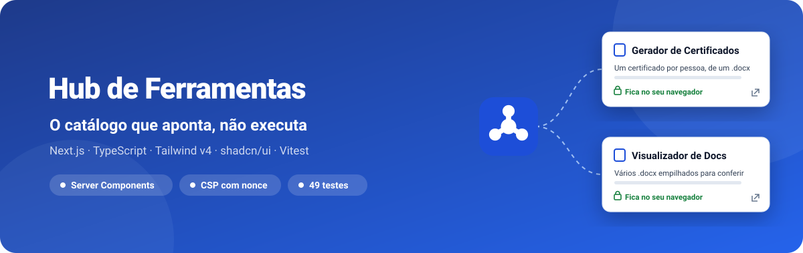
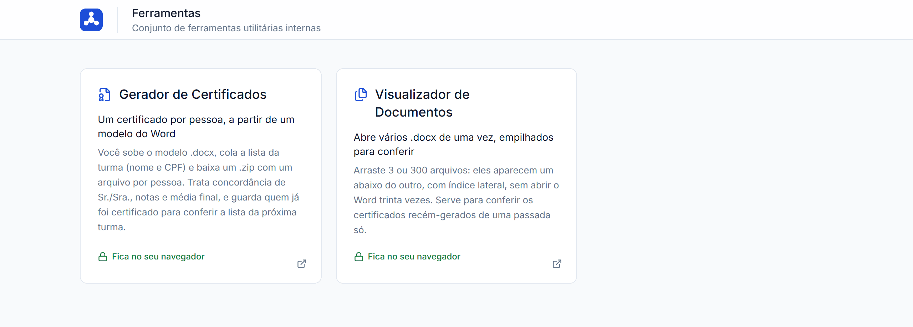
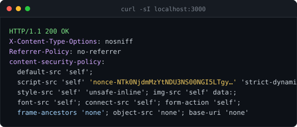
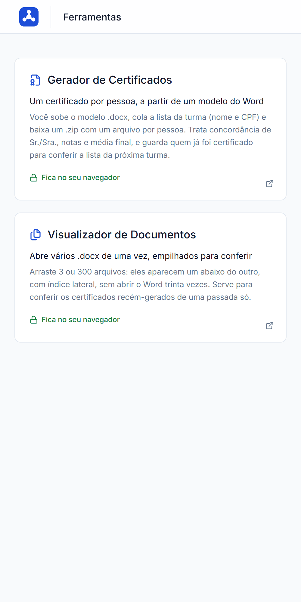
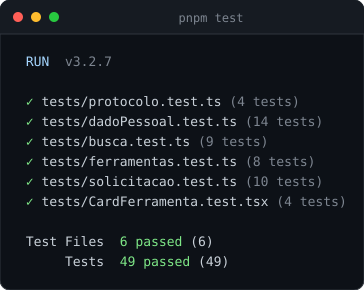

<div align="center">



**Uma página que lista as ferramentas internas em cards e leva a cada uma — sem executar nada, sem dado pessoal na tela.**

[](https://hub-ferramentas-ten.vercel.app)
[](package.json)
[](https://github.com/kessleru/hub-ferramentas/commits/main)



</div>

## Sobre

O hub é a porta de entrada de uma família de ferramentas: quem usa o **Gerador de Certificados** e
o **Visualizador de Documentos** abre esta página para escolher qual. Ele **aponta, não executa** —
não abre documento, não embute ferramenta em iframe e não mostra dado pessoal nenhum.

Cada card diz o que a ferramenta faz na língua de quem tem o problema e carrega um **selo de
privacidade**: "Fica no seu navegador" quando a ferramenta não manda dado para servidor nenhum.

## Como é feito

- **Server Components.** O catálogo vem pronto no HTML da resposta: com o JavaScript desligado, os
  cards e os links continuam lá (conferido numa captura com JS desativado, idêntica à de cima).
- **Catálogo tipado num arquivo só.** [`lib/ferramentas.ts`](lib/ferramentas.ts) é a fonte da
  verdade, lida no build; acrescentar ferramenta é editar esse array. O `id` nunca muda, a ausência
  de `url` significa "ainda não existe" e `privacidade` é declaração, não enfeite.
- **Busca que aparece quando precisa.** A partir de 7 ferramentas a grade ganha um campo de busca,
  com o atalho <kbd>/</kbd> (que não dispara enquanto se digita em outro campo).
- **Cabeçalhos de segurança de verdade.** CSP com *nonce* gerado por requisição no
  [`middleware.ts`](middleware.ts) — sem `'unsafe-inline'` em `script-src` — e `frame-ancestors`
  enviado como cabeçalho, não `<meta>`, onde ele seria ignorado.



## Telas

<table>
<tr>
<td width="50%"></td>
<td width="50%">

No celular os cards empilham numa coluna. O favicon e a marca seguem o padrão da família em
[`PADRAO-FAVICON.md`](PADRAO-FAVICON.md): a mesma moldura em todos os projetos e um glifo diferente
em cada um, para distinguir as abas sem ler o título.

</td>
</tr>
</table>

## Testes



Vitest com Testing Library e jsdom. Cobrem o catálogo, a busca, o card e os utilitários de
`lib/` — tudo função pura, que é onde mora a lógica.

## Stack

| Camada | Ferramenta |
|---|---|
| Framework | [Next.js](https://nextjs.org) (App Router) + [React 19](https://react.dev) |
| Linguagem | [TypeScript](https://www.typescriptlang.org) |
| Estilo | [Tailwind CSS v4](https://tailwindcss.com) (tokens em `@theme`), [shadcn/ui](https://ui.shadcn.com), [Lucide](https://lucide.dev) |
| Testes | [Vitest](https://vitest.dev) + [Testing Library](https://testing-library.com) |
| Deploy | [Vercel](https://vercel.com) |

## Rodando localmente

```bash
git clone https://github.com/kessleru/hub-ferramentas.git
cd hub-ferramentas
pnpm install
pnpm dev
```

O Next sobe em `http://localhost:3000`.

O `.env.example` lista as variáveis do Resend de um formulário de solicitação que saiu do projeto;
a página atual não usa nenhuma delas.

### Scripts

| Comando | O que faz |
|---|---|
| `pnpm dev` | Servidor de desenvolvimento |
| `pnpm build` | Build de produção |
| `pnpm start` | Serve o build |
| `pnpm lint` | ESLint (config do `create-next-app`) |
| `pnpm test` | Vitest, uma vez |
| `pnpm test:watch` | Vitest em modo watch |

## Estrutura

```
├── app/
│   ├── page.tsx            # cabeçalho + catálogo
│   ├── layout.tsx
│   ├── icon.svg            # favicon (padrão da família)
│   └── opengraph-image.tsx
├── components/
│   ├── Cabecalho.tsx
│   ├── GradeFerramentas.tsx  # decide se mostra a busca (≥ 7 ferramentas)
│   ├── GradeComBusca.tsx     # busca + atalho /
│   ├── CardFerramenta.tsx    # selos de estado e de privacidade
│   └── ui/                   # shadcn/ui
├── lib/                    # catálogo, busca, teclado, limites… (funções puras)
├── middleware.ts           # CSP com nonce por requisição
├── next.config.ts          # demais cabeçalhos de segurança
└── tests/
```

<details>
<summary><b>Regerando as imagens deste README</b></summary>

```bash
node .github/readme/gerar.mjs                 # banner e cartões de terminal (SVG)

pnpm build && pnpm start                      # em outro terminal
pnpm add -D puppeteer-core sharp              # desfaça depois com git restore
node .github/readme/capturar.mjs              # telas em 2x
```

</details>

---

<div align="center">
<sub>Feito por <a href="https://github.com/kessleru">Otávio Kessler Ustra</a></sub>
</div>
